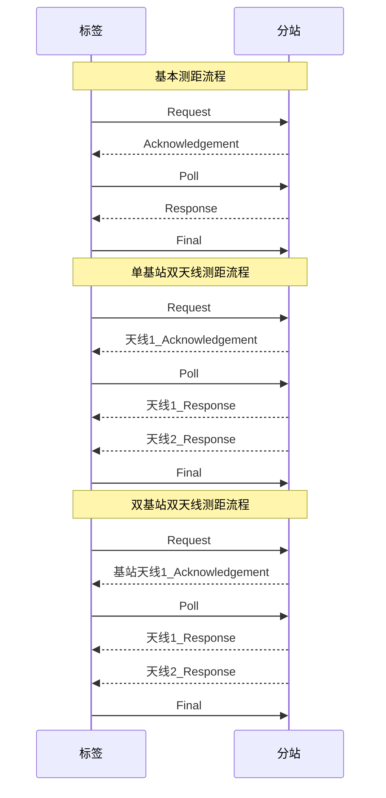

```mermaid
sequenceDiagram
    participant tag as 标签
    participant anchor as 分站

    Note over tag,anchor: 基本测距流程
    tag->>anchor: Request
    anchor-->>tag: Acknowledgement
    tag->>anchor: Poll
    anchor-->>tag: Response
    tag->>anchor: Final       

    Note over tag,anchor: 单基站双天线测距流程
    tag->>anchor: Request
    anchor-->>tag: 天线1_Acknowledgement
    tag->>anchor: Poll
    anchor-->>tag: 天线1_Response 
    anchor-->>tag: 天线2_Response
    tag->>anchor: Final   

    Note over tag,anchor: 双基站双天线测距流程
    tag->>anchor: Request
    anchor-->>tag: 基站天线1_Acknowledgement
    tag->>anchor: Poll
    anchor-->>tag: 天线1_Response 
    anchor-->>tag: 天线2_Response
    tag->>anchor: Final   
```